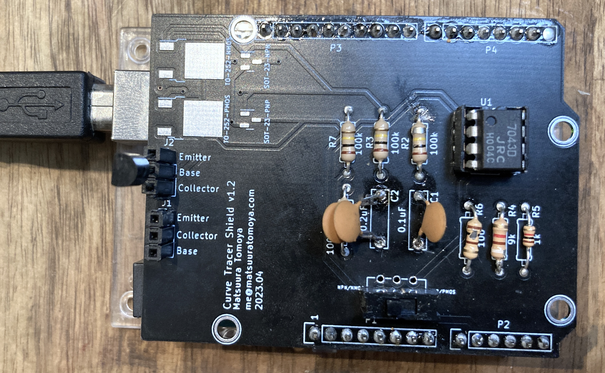
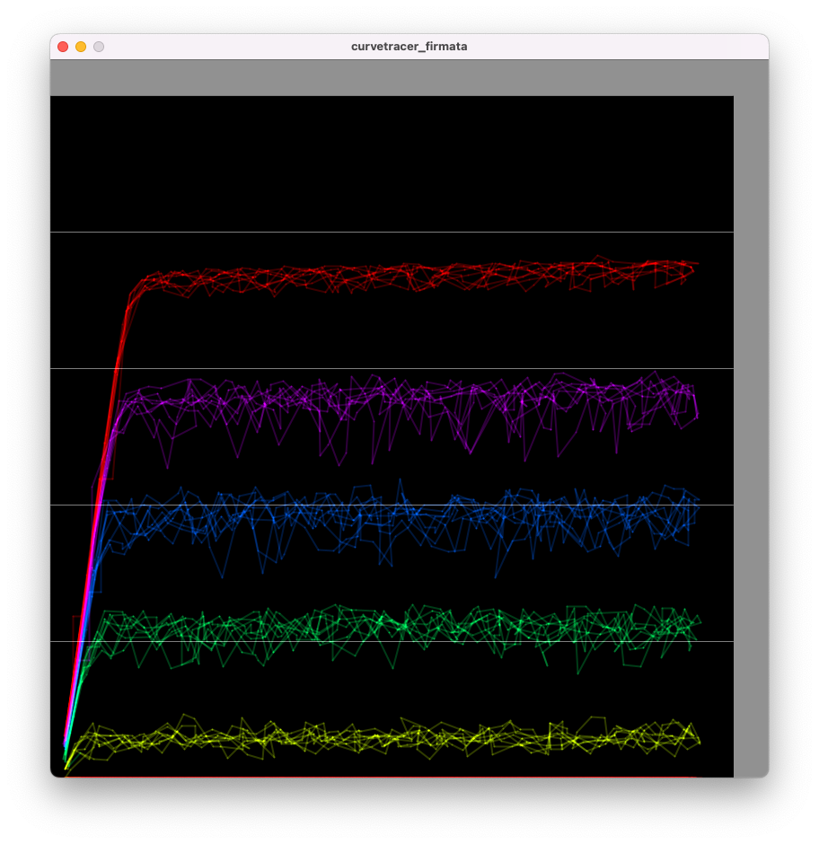

# Simple Curve Tracer Shield for Arduino Uno

A shield circuit board for Arduino Uno to analyze the characteristics of a transistor of FET with minimal components.

2023.04 Matsuura Tomoya

## Required Components

- Rail-to-Rail Op Amp(DIP8 Package) x1
- Resistors
    - 100k x 5
    - 1k x 1
    - 9k x 1
- Capacitors
    - 0.1uF(104) x 1
    - 0.2uF(204) x 1
- SPDT Switch(or, 3-Pin header w/ Jumper Pin)
- 3 Pin Deep Socket for Transistor x 2
- 2.54mm Pin Header for Arduino Socket

## Required Softwares

- Arduino IDE
- Processing
- KiCad

## How To Use the Shield

1. Connect Arduino to PC
1. Open Examples->Firmata->StandardFirmata
1. Upload it
1. Stack the shield onto Arduino
1. Check the polarity of the slide switch depending on what types of transistor you are going to test(NPN/NMOS or PNP/PMOS).
1. Open curvetrace_firmata.pde with Processing and run it.
1. Hit "s" key and it will start plotting.

## Reference 

This project is heavily based on the Project below.

**Arduino BiCMOS Curve Tracer by Don Sauer**

http://www.idea2ic.com/BiCmosCurveTracer/Arduino%2520BiCmos%2520Curve%2520Tracer.html

The hardware structure is mostly the same. 200k resistor is replaced with 100k resistor*2 for the simplicity.

The original software uses raw serial connection between Arduino and Processing. I merged the two codes into 1 Processing sketch by using [Firmata](https://docs.arduino.cc/hacking/software/FirmataLibrary), the multi-purpose serial protocol for controlling arduino.

Instead, the function of exporting raw data for plotting with external application (like Octave and Scilab) is omitted.